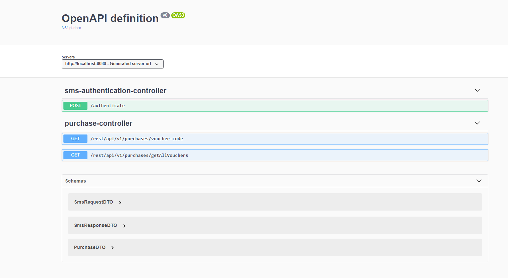
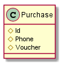

#Purchase prepaid data

## Architecture

The project was design with hexagonal architecture with Domain Driven Design
* **Presentation layer**: contain the presentation of application. It maybe a rest, a console, a batch application. In this project, it's a rest service 
* **Domain layer**: purchase-domain. It will contain all the interface for bussiness logic. This domain we did not use any third party library
* **Database**: H2 for just demo purpose
* **Infrastructure layer**: This is layer which use for implement adapters to plug into the hexagonal architecture. It includes all the conrete implementation of jpa, rest...
    1. purchase-data-jpa: include all implement of jpa. it implements the domain repository
    2. purchase-data-rest: implement all classes for calling third-party rest client
* **Bootstrap**: This is the main part. In this component, it will know all the implementations.
## Pattern
* Adapter

#API  Documentation
Swagger use to help user can execute the rest API with documentation
Link: <http://localhost:8080/swagger-ui.html>


# Entity table


## Libraries
- Spring boot, Spring security
- Mockito
- Lombok, mapstruct, flyway
- Wiremock

#H2
* Console link: http://localhost:8080/h2-console
* Database name:jdbc:h2:mem:testdb
* User: sa
* Pass:
#How to run project
- Just run the PurchaseApplicationLocal. it will also build a fake third party client on port 8081 by wiremock
#Some operations:
* Get voucher code: 
    * **CURL**:
    curl -X GET "http://localhost:8080/rest/api/v1/purchases/voucher-code?phone=090909" -H  "accept: */*"
    * **Return value**:
    ```
    {
      "id": 1,
      "phone": "090909",
      "voucherCode": "ABCXYZ"
    }
    ```
* Authenticate with sms message
    * At the first time, if you call getAllVouchers, you will receive 401 code
        * **CURL**
                
                curl -X GET "http://localhost:8080/rest/api/v1/purchases/getAllVouchers?phone=0909090909"
        * **Return value**
                
                {
                  "timestamp": "2020-12-01T15:37:53.904+00:00",
                  "status": 401,
                  "error": "Unauthorized",
                  "message": "",
                  "path": "/rest/api/v1/purchases/getAllVouchers"
                }
                
    * Call to get code through sms:
        * **CURL**
                
                curl -X POST "http://localhost:8080/authenticate" -H  "accept: */*" -H  "Content-Type: application/json" -d "{\"phone\":\"0909090909\"}"
        * **Return value**
            ```
            {
              "smsToken": "773526"
            }
            ```
    * Use this token to call get all voucher which belongs the phone 0909090909
         * **CURL**
                 
                curl -X GET "http://localhost:8080/rest/api/v1/purchases/getAllVouchers?phone=0909090909" -H  "Authorization:855891"

         * **Return value**
             ```
             [{"id":1,"phone":"0909090909","voucherCode":"ABCXYZ"}]
             ```